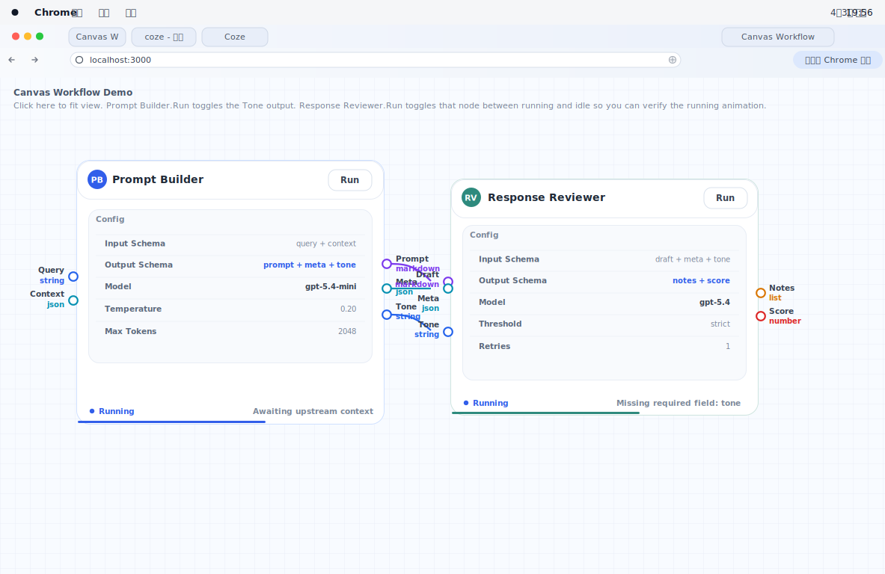
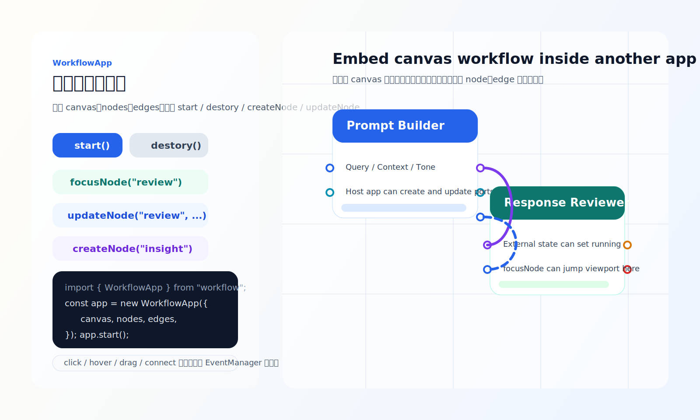

# workflow

一个完全基于 `canvas` 绘制的 workflow 引擎原型，使用 `bun` 管理构建与本地运行。项目既包含编辑器 demo，也提供了可供第三方应用直接集成的 `WorkflowApp` 入口。

## 预览

### 主界面



### 第三方接入示例



## 当前能力

- 纯 `canvas` 节点、端口、连线、表格、图片、文字绘制
- `RenderManager` 调度渲染、缩放、平移、`fitView`、`focusNode`
- `Mouse` 统一处理 hover、click、拖拽、框选、连线吸附
- `EventManager` 向外委托 `hover / select / click / drag / connect` 事件
- `Scene + History + KeyControl` 支持选择、删除、撤销、重做
- `Node` 支持 `header / content / footer`、端口、参数表、运行态动画
- `Edge` 支持类型校验、连线吸附、运行中虚线流动特效
- 对外导出 `WorkflowApp`，支持 `start / destory / createNode / updateNode`

## 安装

```bash
bun install
```

## 本地运行

```bash
bun run dev
```

默认页面：

- 主 demo: `http://localhost:3000/`
- benchmark: `http://localhost:3000/benchmark.html`
- 第三方接入示例: `http://localhost:3000/integration.html`

如果 `3000` 被占用，服务会自动尝试后续端口。

## 构建

构建 demo 页面资源：

```bash
bun run build
```

构建对外集成库：

```bash
bun run build:lib
```

库产物会输出到 `dist/index.js`。

## GitHub Pages 演示

这个项目现在已经补成可直接发布到 GitHub Pages 的静态站点方案。

### 本地生成 Pages 产物

```bash
bun run build:pages
```

执行后会把可发布内容生成到 `docs/`：

- `docs/index.html`
- `docs/benchmark.html`
- `docs/integration.html`
- `docs/assets/*`
- `docs/.nojekyll`

### 直接用 GitHub Pages 发布

仓库里已经带了官方 Actions workflow: `.github/workflows/deploy-pages.yml`。

推荐做法：

1. 把仓库推到 GitHub 的 `main` 分支。
2. 在仓库设置里打开 GitHub Pages，并选择 `GitHub Actions` 作为 Source。
3. 后续每次 push 到 `main`，Actions 都会自动执行 `bun run build:pages` 并发布。

### 备用方案

如果你不想走 Actions，也可以直接使用 `docs/` 目录作为发布源：

1. 本地执行 `bun run build:pages`
2. 提交生成后的 `docs/`
3. 在 GitHub Pages 设置里选择 `Deploy from a branch`
4. 选择 `main` 分支下的 `/docs` 目录

目前页面资源已经改成了相对路径，所以无论站点挂在 `https://<user>.github.io/<repo>/` 还是仓库根路径下都可以正常加载。

## 第三方接入

对外入口在 `src/index.ts`，核心类在 `src/WorkflowApp.ts`。

### 最小接入

```ts
import { WorkflowApp, type WorkflowEdgeModel, type WorkflowNodeModel } from "workflow";

const canvas = document.querySelector("canvas") as HTMLCanvasElement;

const nodes: WorkflowNodeModel[] = [
  {
    id: "prompt",
    title: "Prompt Builder",
    logoText: "PB",
    actionLabel: "Run",
    x: 120,
    y: 140,
    width: 440,
    height: 320,
    color: "#2563eb",
    inputs: [],
    outputs: [{ id: "prompt", label: "Prompt", dataType: "markdown" }],
    parameters: [{ label: "Model", value: "gpt-5.4-mini" }],
    statusLabel: "Ready",
    statusTone: "idle",
    errorText: "",
  },
];

const edges: WorkflowEdgeModel[] = [];

const app = new WorkflowApp({ canvas, nodes, edges });
app.start();
```

### 生命周期

```ts
app.start();
app.destory();
```

### 宿主应用创建一个 Node

```ts
app.createNode(
  {
    id: "insight",
    title: "Insight Ranker",
    logoText: "IR",
    actionLabel: "Run",
    x: 980,
    y: 120,
    width: 420,
    height: 280,
    color: "#7c3aed",
    inputs: [{ id: "notes", label: "Notes", dataType: "array" }],
    outputs: [{ id: "summary", label: "Summary", dataType: "markdown" }],
    parameters: [{ label: "Model", value: "gpt-5.4-mini" }],
    statusLabel: "Ready",
    statusTone: "idle",
    errorText: "",
  },
  { focus: true },
);
```

### 宿主应用更新某个 Node

```ts
app.updateNode("prompt", {
  title: "Prompt Builder v2",
  statusTone: "running",
  statusLabel: "Running",
  errorText: "Streaming prompt assembly",
});
```

### 宿主应用动态更新端口

```ts
app.updateNode("prompt", {
  outputs: [
    { id: "prompt", label: "Prompt", dataType: "markdown" },
    { id: "meta", label: "Meta", dataType: "json" },
    { id: "tonePreset", label: "Tone", dataType: "string" },
  ],
});
```

### 监听全局事件

```ts
app.on("click", (event) => {
  console.log(event.target?.nodeId, event.target?.item);
});

app.on("dragmove", (event) => {
  console.log(event.drag?.nodePosition);
});

app.on("connectend", (event) => {
  console.log(event.connection?.state, event.connection?.createdEdgeId);
});
```

### 视口控制

```ts
app.fitView();
app.focusNode("review", { scale: 1.15 });
```

## 可运行 examples

- 接入示例页面: `public/integration.html`
- 接入示例逻辑: `src/integration-example.ts`
- 主 demo 页面: `public/index.html`
- benchmark 页面: `public/benchmark.html`

`integration.html` 演示了这些典型宿主操作：

- `start()` 启动 workflow
- `destory()` 销毁实例
- `createNode(...)` 创建新节点
- `focusNode("review")` 聚焦节点
- `updateNode("review", ...)` 切换运行状态
- `updateNode("prompt", ...)` 修改标题、参数和输出端口

## 项目结构

- `src/index.ts`
  对外导出入口
- `src/WorkflowApp.ts`
  第三方应用集成类
- `src/render/RenderManager.ts`
  画布尺寸、渲染调度、视口控制
- `src/input/Mouse.ts`
  hover、拖拽、平移、缩放、连线
- `src/events/EventManager.ts`
  全局事件委托
- `src/workflow/Scene.ts`
  场景节点、边、选择和同步
- `src/draw/NodeDraw.ts`
  节点绘制与交互语义
- `src/draw/EdgeDraw.ts`
  连线绘制与运行态效果
- `src/draw/TableDraw.ts`
  表格绘制与行交互

## 后续方向

1. 外部数据源和 store 自动同步
2. 平滑过渡版 `fitView / focusNode`
3. 更完整的命令总线和编辑器协议
4. 参数表单的真正编辑能力
